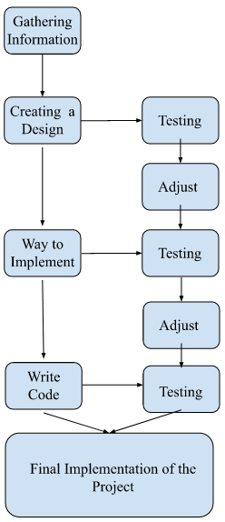

# Architecture Document

### Teammates

* Lex T. Feliciano Laracuente
* Edwin J. Jimenez Lugo
* Angel G. Soto Acevedo

### Abstract

## Logical View Architecture

This system consists of an ESP32 device that will be equipped with a temperature sensor and a proximity sensor. Both devices will be set around the room to send measurements to the central computer in the cloud. This would be used to provide the necessary information to the user. The system will include a communication interface between the ESP32 and the computer, an interface for voice commands, and another interface for the application. Some of the interactions that will occur between the system are:
* The computer will process and store data.
* The application will retrieve data from the computer.
* Siri (voice assistant) will receive a voice command and help the user obtain the required information. 

## Process View Architecture

The ESP32 will continuously collect information like the temperature of the room and sensor measurements for people in the room. This information will be sent to the computer. The computer will filter and compute the data to generate the requested measurements. This information will be stored in the cloud. When the voice command is given, the data will be retrieved from the cloud and Siri will show the information to the user. 

## Development View Architecture

The development process involves gathering the required information to start the project, creating a design, finding a way to implement it, testing it to see if it works, and presenting it when finalized. The code used is clear and readable, and the creators could work effectively to obtain the desired goal. The final project will be uploaded to the cloud for its implementation. During the duration of this project, the system will be tested constantly to ensure effectiveness and reliability. 

## Physical View Architecture

The physical parts of the projects include the ESP32 device that will be physically connected to a breadboard and other components to work. Furthermore, the system consists of a computer connected to the internet and the cloud to receive and send data. Siri will be available through a smartphone, which will provide accessibility to the user. Furthermore, the phone is the device that will create communication between the user and Siri. All connections will be secure because the system will consist of a firewall. 

## Scenarios
* A user wants to know the temperature of a specific room and how many people are inside the room at the time of the request. The system will provide the information to the user. 
* If an additional ESP32 device is added to the system, a user could obtain information about another room on campus. All the devices would be connected to a cloud server for effective communication. 
